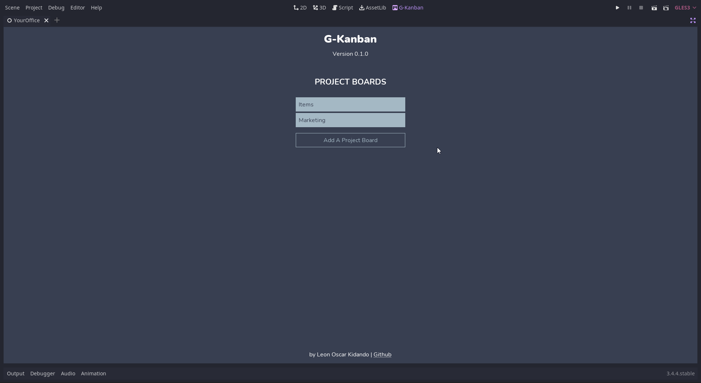
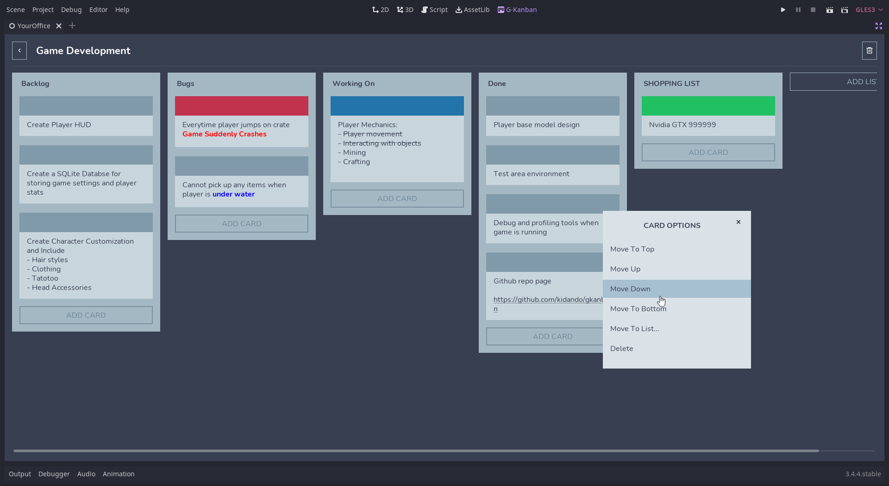

# G-Kanban

Use kanban project boards in the Godot Editor. G-Kanban provides similar functionality to apps like Trello. Create lists and manage cards within those lists.

<iframe
    width="640"
    height="480"
    src="https://youtu.be/wphLTOBDn1s"
    frameborder="0"
    allow="autoplay; encrypted-media"
    allowfullscreen
>
</iframe>

## Current Release
This is currently an **Alpha** release of the project. Now that I have gotten everything to work on the front-end, I plan to re-write the backend for readability, better maintainability and scalability. A lot of "bilities". Some front-end things could change. I will prioritize keeping things backwards compatible because I don't see why the saved data "structure" should change.

## Installation

1. Clone the project or download a zip to your computer.
2. Unzip the project and copy the addons folder into your godot project.
3. Then in the Godot Editor, go to Project Settings then click on the Plugins tab and enable G-Kanban
4. Open G-Kanban by clicking on the G-Kanban link on the top of the editor right next to 2D, 3D, Script and AssetLib

## Creating And Managing Project Boards

- Simply click on Add A Project Board. Give it a name like Core Development and save it.
- Click on the newly created project board and it should take you to the project board page
- You can edit the name of the board by clicking on the name and once done, hitting enter
- You can delete the entire board by clicking on the trash icon on the top right. A confirmation dialog will pop up
- Add a list, give it a name and add cards to it.
- List can be re-arranged
- Cards can also be re-arranged and color-tagged
- You can use Godot's BBCODE in the cards

## How Project Boards Are Saved

G-kanban creates a .gkanban folder with two files in it. One for settings and the other for storing your project boards. By default Godot doesn't make make visible files and folder with the "." prefix (I think). This way it won't intefere with your workflow when working on your projects. Making the .gkanban a part of your repo will ensure that your project boards stay glued to your project.

## Features That I Plan To Add

If you have used this plugin, you can tell that there are areas that could use a lot more love and attention. But I'm not trying to go too crazy with this project. Some of the things I want to add are listed below.  

- Drag and drop for lists and cards
- More detailed card editor
- Custom card types
- Keyboard Shortcuts
- Archived Lists and cards
- Themes
- Better UUIDs / GUIDs

## Assets Used

- [Remix Icon](https://remixicon.com/)
- [JetBrains Mono Font](https://fonts.google.com/specimen/JetBrains+Mono?query=jetbrains)
- [Nunito Font](https://fonts.google.com/specimen/Nunito?query=nunito)

## Consider Donating

If you like the tool and would like to get me a cup of coffee, I would be grateful. You can [visit my coffee page](https://www.buymeacoffee.com/kidando).

You can chekout some of my games on [Itch.io](https://kidando.itch.io/) and [Gamejolt](https://gamejolt.com/@Kidando). 
